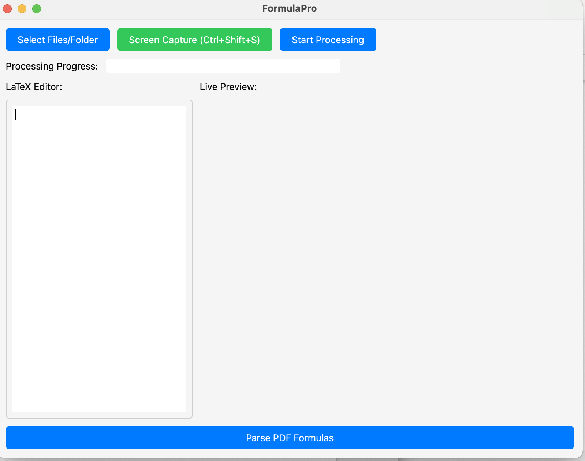
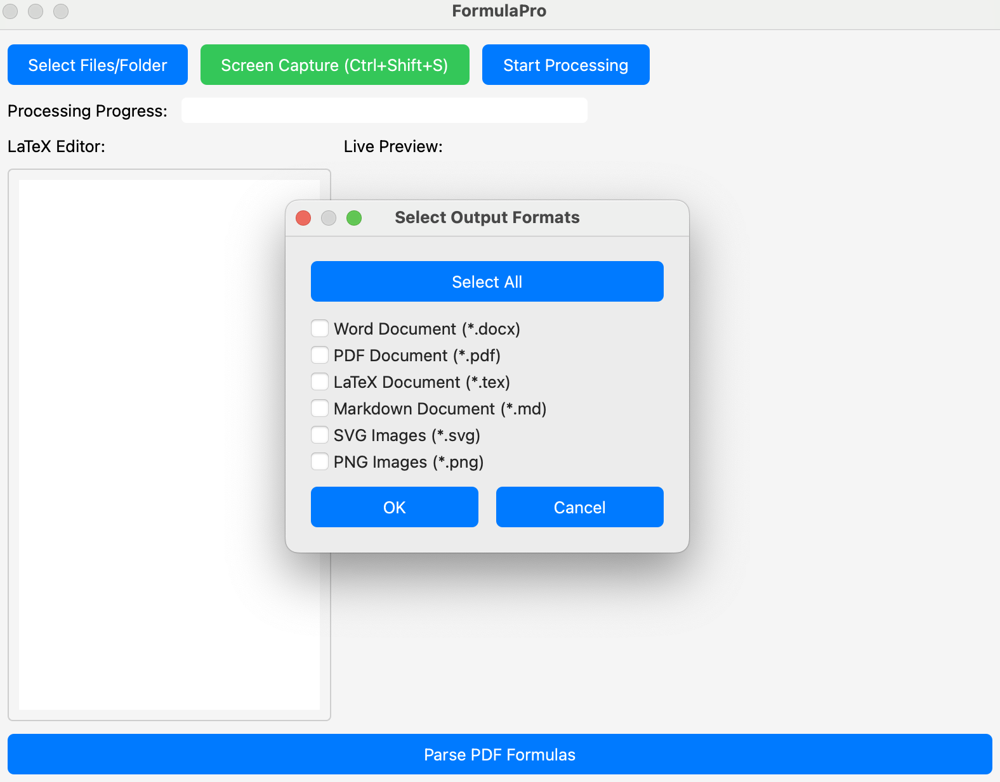

# LaTeX Formula Recognition

A powerful desktop application for recognizing and converting mathematical formulas from images to LaTeX code.

## Features

- 📸 Image-based formula recognition
- 🔄 Convert mathematical formulas to LaTeX code
- 🎨 Modern and user-friendly GUI interface
- 🔒 Secure API key management using system keyring
- 📝 Export to multiple formats (PNG, SVG, PDF, DOCX, Latex, Markdown)
- 🖼️ Support for various image formats(PNG, JPG, JPEG)
- 🔍 High-accuracy formula detection

## Screenshots

### Main Interface


### Export Options


## Quick Start (For Users)

### Download Pre-built Application

You can download the pre-built application for direct use:

- For macOS: [FormulaPro.app](releases/FormulaPro.app.zip)
- For Windows: Coming soon
- For Linux: Coming soon

After downloading:
1. Unzip the file
2. For macOS users: Move `FormulaPro.app` to your Applications folder
3. Launch the application
4. Enter your Qwen API key when prompted

## Installation (For Developers)

If you want to run from source code or contribute to the project:

1. Clone the repository:
```bash
git clone https://github.com/nicetoMingyu/LaTeX_Formula_Recognition.git
cd LaTeX_Formula_Recognition
```

2. Create and activate a virtual environment:
```bash
python -m venv venv
source venv/bin/activate  # On Windows, use: venv\Scripts\activate
```

3. Install dependencies:
```bash
pip install -r requirements.txt
```

## Configuration

1. Create a `.env` file in the project root:
```
Qwen_API_KEY=your_api_key_here
```

2. The application will securely store your API key using the system keyring.

## Usage

1. Run the application:
```bash
python src/main.py
```

2. Use the GUI to:
   - Upload images containing mathematical formulas
   - View and edit recognized LaTeX code
   - Export results in various formats

## Development

The project structure is organized as follows:
```
src/
├── core/       # Core functionality and business logic
├── gui/        # GUI components and windows
├── config/     # Configuration files
└── main.py     # Application entry point
```

## License

This project is licensed under the MIT License - see the [LICENSE](LICENSE) file for details.

## Contributing

Contributions are welcome! Please feel free to submit a Pull Request.

## Acknowledgments

- Qwen for providing the API
- PyQt6 for the GUI framework
- All other open-source libraries used in this project 